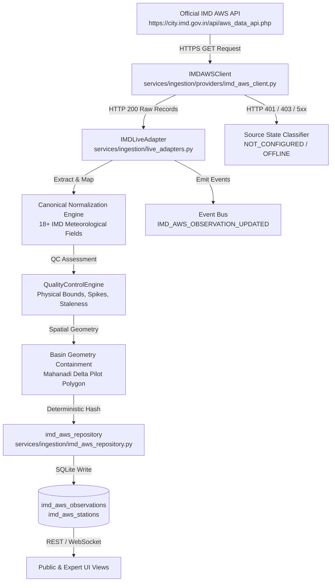

# India Meteorological Department (IMD) Automatic Weather Station (AWS) Integration

## Overview

The India Meteorological Department (IMD) operates a nationwide network of surface **Automatic Weather Stations (AWS)** and **Automatic Rain Gauges (ARG)** providing near-real-time observations of critical surface hydrometeorological variables.

In JALDRISHTI AI, the `IMDLiveAdapter` connects to official IMD AWS endpoints (`https://city.imd.gov.in/api/aws_data_api.php`) to ingest ground-truth surface telemetry without fabricating synthetic values or creating false assumptions about live connectivity.

---

## Architectural Architecture

---

## Key Design & Honesty Principles

1. **Source Veracity & Truth in Labeling**:
   - If official access is denied or unconfigured (due to government IP whitelisting requirements), JALDRISHTI AI accurately reports `NOT_CONFIGURED` or `ACCESS_DENIED`.
   - The platform **never fabricates artificial observations** and **never labels mock data as LIVE**.

2. **Rainfall Non-Invention**:
   - When an IMD AWS station does not report rainfall in its raw telemetry feed, the variable is stored and presented as `None` / `N/A`. It is **never defaulted to 0.0 mm** or an artificial number.

3. **Deterministic Deduplication**:
   - Observations are identified by `IMD_AWS_{call_sign}_{observation_time}` with SHA-256 deduplication ensuring polling cycles never insert duplicate records.

4. **Cryptographic Auditability & Provenance**:
   - Every raw ingestion payload is hashed using SHA-256 and stored alongside the observation record in `imd_aws_observations`.
