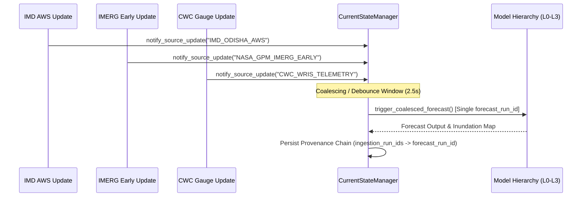

# Coalesced Forecast Triggering & Concurrency Control
## JALDRISHTI AI (SIH26071)

---

## 1. Coalescing Window & Aggregation

When multiple asynchronous external sources deliver observations within a brief time window (e.g. IMD AWS, IMERG Early, and CWC gauges arriving within seconds of each other), JALDRISHTI AI does not launch separate overlapping forecast runs.

---

## 2. Concurrency Safety & Running-State Locks

1. **Running-State Lock:** If a forecast computation is currently executing, incoming updates are queued and coalesced into the subsequent run cycle.
2. **Minimum Forecast Throttling:** Ensures the deep model pipeline is not triggered more frequently than the configured minimum forecast interval ($5.0\text{ seconds}$).
3. **Atomic Run Identification:** Every forecast run generates an immutable `forecast_run_id` (e.g. `FR-LIVE-20260827-XXXXXX`).
