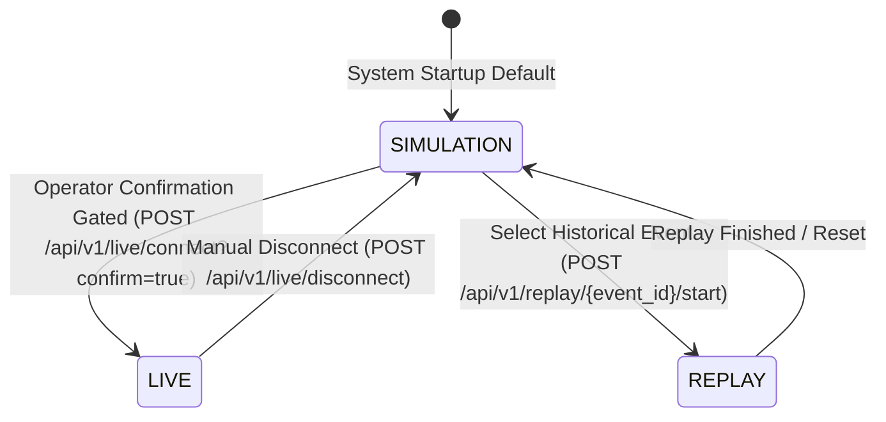

# Live Mode State Machine & Operational Transitions
## JALDRISHTI AI (SIH26071)

---

## 1. Multi-Dimensional State Model

JALDRISHTI AI strictly maintains orthogonal state dimensions:

### Orthogonal State Definitions:
1. **`SYSTEM MODE`:** `SIMULATION` | `REPLAY` | `LIVE`
2. **`DATA STATE`:** `HEALTHY` | `DEGRADED` | `STALE` | `OFFLINE` | `NOT_CONFIGURED` | `MOCK_LIVE` | `SYNTHETIC` | `REAL_HISTORICAL`
3. **`MAP STATE`:** `LIVE_MAP` | `OFFLINE_MAP`

---

## 2. Safety Gating Rule

Switching from `SIMULATION` to `LIVE` requires explicit operator confirmation via `confirm=true`. The system displays:
> **⚠️ LIVE DATA MAY BE DELAYED OR DEGRADED.**
> This platform is a research decision-support prototype and must not control infrastructure.
