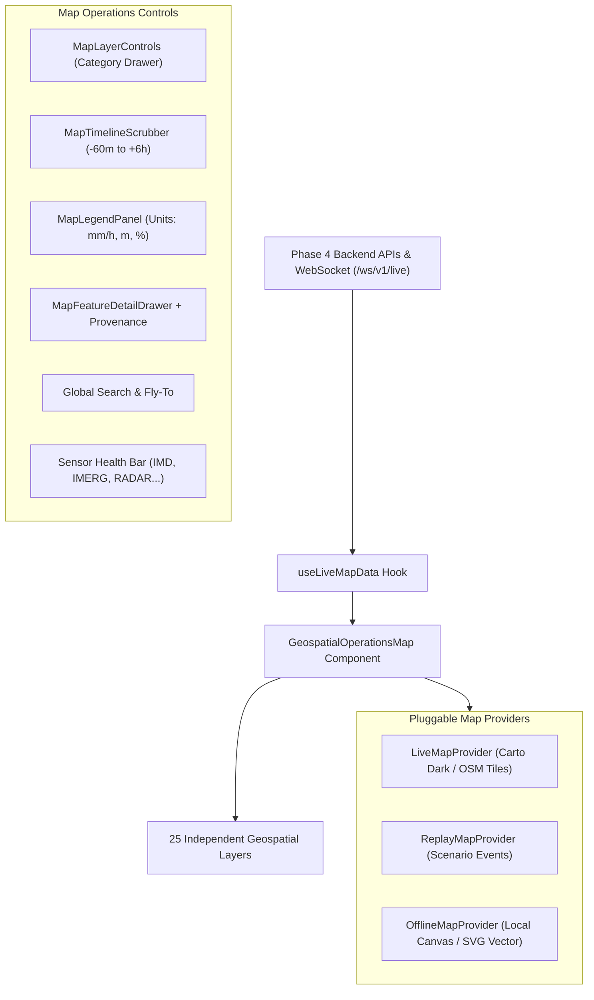

# Real-Time Geospatial Operations Map Architecture
## JALDRISHTI AI (SIH26071)

This document describes the architectural design of the Real-Time Geospatial Operations Map, its layer lifecycle, multi-provider abstraction, offline fallback mechanism, and Phase 4 API integration.

---

## 1. Map Architecture Overview

---

## 2. Pluggable Map Provider Hierarchy

1. **`LiveMapProvider` (Primary Mode):**
   - Renders full geographic basemaps using Carto Dark Matter / OpenStreetMap vector and raster tiles.
   - **Zero Proprietary API Keys Required:** Does not require Mapbox, MapTiler, Google Maps, or paid commercial tokens.
2. **`ReplayMapProvider` (Simulation / Replay Mode):**
   - Driven by the 11-stage seeded deterministic scenario clock or historical event replay.
3. **`OfflineMapProvider` (Local Resilient Fallback):**
   - Automatically engaged upon tile loading failure or field disconnection.
   - Renders local bounding box vector geometry, river channels, stations, and flood extent directly from cached GeoJSON memory without network dependency.

---

## 3. Phase 4 Rainfall & ML Integration

The map is the spatial window into the existing JALDRISHTI intelligence pipeline:
- **No Duplicate Simulation:** Directly consumes `/api/v1/rainfall/nowcast`, `/api/v1/rainfall/sources`, and `/api/v1/stations`.
- **Honest Computational Grid Representation:** The 2.5 km precipitation grid is labeled explicitly as `MODEL GRID: 2.5 km` (computational representation, not native sensor resolution).
- **Radar State Handling:** When Paradip Doppler Radar is unavailable, the layer is marked `RADAR DATA UNAVAILABLE` with zero fabricated radar imagery.
