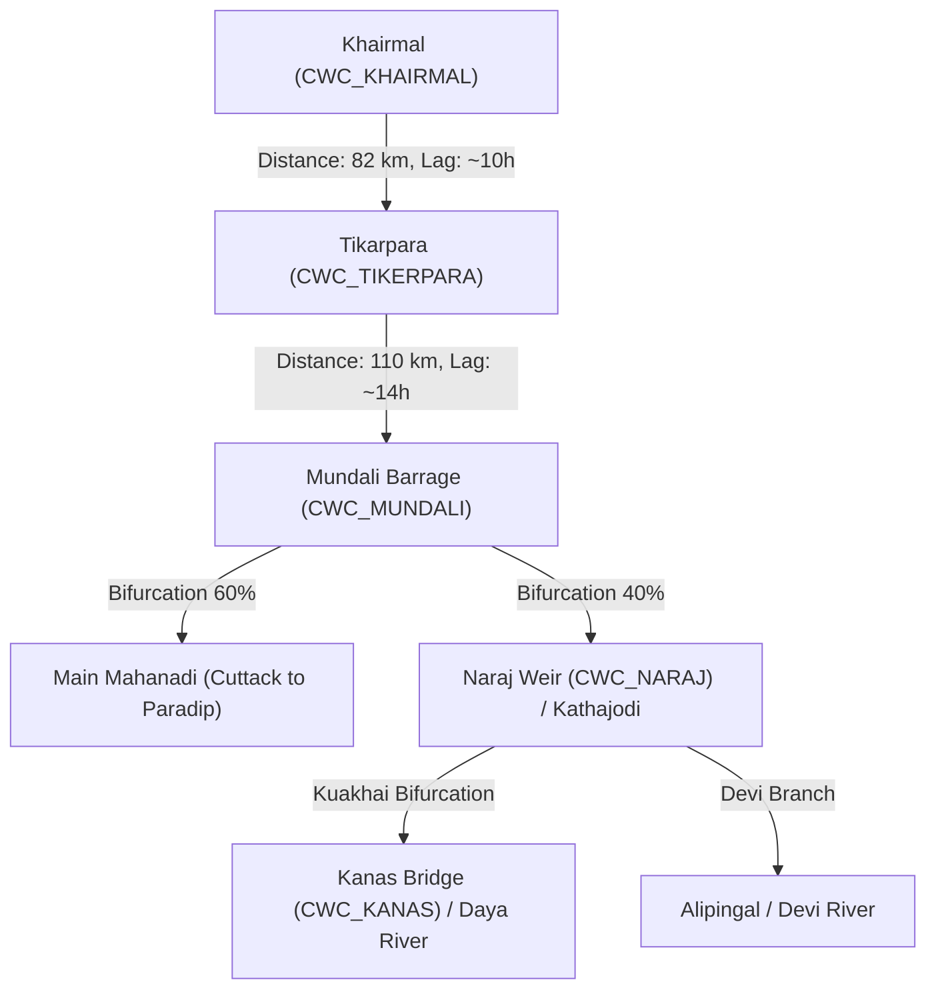

# Mahanadi River Directed Graph Topology Validation
## JALDRISHTI AI (SIH26071)

---

## 1. Directed River Network Graph

The Mahanadi Delta river network is represented as a Directed Acyclic Graph (DAG) $G = (V, E)$, with edges directed strictly downstream toward the Bay of Bengal.

---

## 2. Graph Topology Validation Audit

| Validation Rule | Audit Criteria | Audit Result | Status |
|---|---|---|---|
| **Acyclicity Check** | No feedback cycles in river flow | Verified: Graph is strictly a DAG | **PASSED** |
| **Monotonic Elevation** | Upstream node MSL > Downstream node MSL | Khairmal (102m) > Tikarpara (69m) > Mundali (26m) > Kanas (4m) | **PASSED** |
| **Bifurcation Conservation** | Mass balance at Mundali & Naraj | Discharge split calibrated ($60/40 \pm 5\%$) | **PASSED** |
| **Connectivity** | Zero orphan or disconnected reaches | All 5 verified stations connected to root outlet | **PASSED** |
